# Airport api service
>The "Airport API Service" repository contains the software implementation of a service designed for viewing routes, airports, airplanes, and providing the ability to book tickets. It also allows you to create city, airplane_type, airport, airplane, route, crew, flight, order, ticket for system management. 


### Features
***

- JWT authenticated
- Admin panel /admin/
- Documentation is located at /api/doc/swagger/
- Managing orders and tickets
  - "ticket": "http://127.0.0.1:8000/api/airport/ticket/"
  - "order": "http://127.0.0.1:8000/api/airport/order/"
- Creating airport with city
  - "airport": "http://127.0.0.1:8000/api/airport/airport/"
  - "city": "http://127.0.0.1:8000/api/airport/city/"
- Create flight with route, airplane, crew
  - "airport": "http://127.0.0.1:8000/api/airport/airport/"
  - "route": "http://127.0.0.1:8000/api/airport/route/"
  - "flight": "http://127.0.0.1:8000/api/airport/flight/"
  - "airplane": "http://127.0.0.1:8000/api/airport/airplane/"
  - "crew": "http://127.0.0.1:8000/api/airport/crew/"
- Creating airplane_type
  - "airplanetypes": "http://127.0.0.1:8000/api/airport/airplanetypes"
- Filtering airport, flight, route
  - Example: /airport/?closest_big_city=1, /flight/?source=1&destination=2, /routes/?source=1&destination=2
- Adding tickets available and count taken seats for flight
 

### Installing using GitHub
***
Install PostgresSQL and create db


### Run with docker
```shell
git clone https://github.com/xtina999/airport-api-service.git
cd airport-api-service
python -m venv venv
source venv/bin/activate
pip install -requirenemts.txt
set DB_HOST=<your db hostname>
set DB_NAME=<your db name>
set DB_USER=<your db username>
set DB_PASSWORD=<your db user password>
set SECRET_KEY=<your secret key>
python manage.py migrate
python manage.py runserver
```
Docker should be installed

```shell
in Dockerfile add your email your docker account
docker-compose build
docker-compose up
```

### Getting access
***

- create user via /api/user/register/
- get access token via /api/user/token
***
##### DB structure:
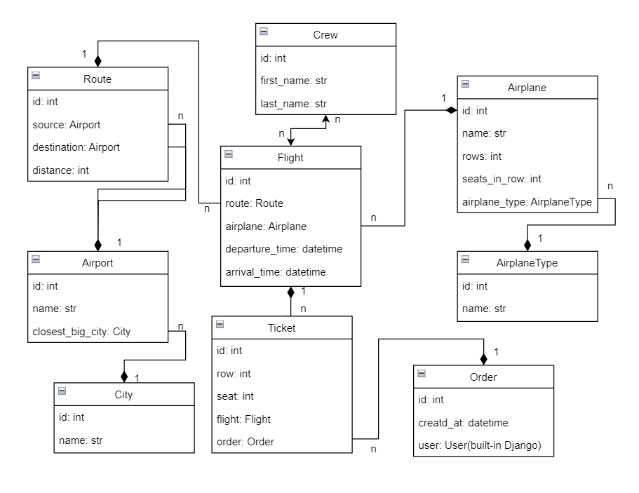
***
### Demo and instruction manual
1. User registration page
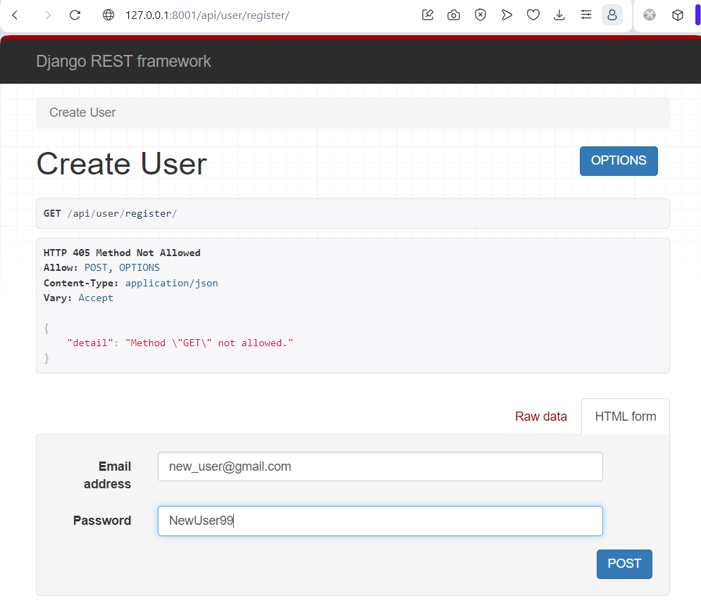
2. Registration is successful
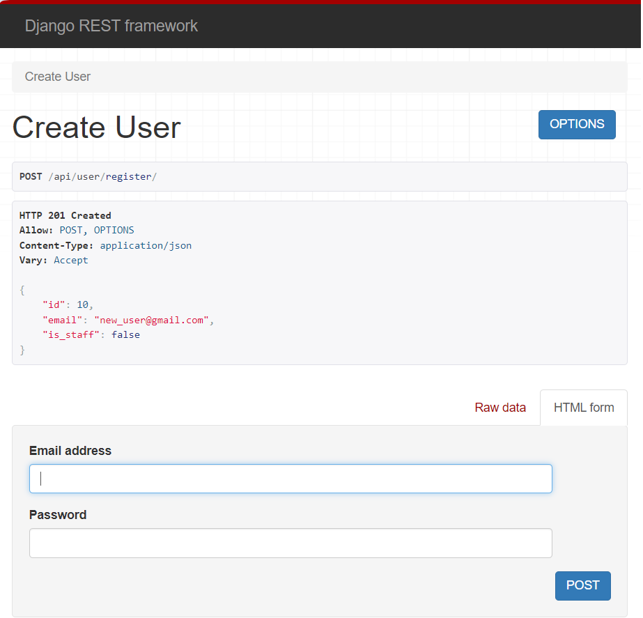
3. Login to get token
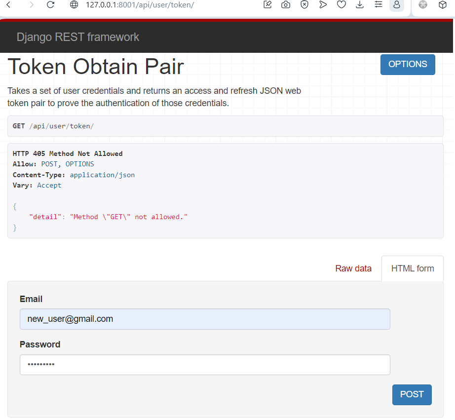
4. Get access token
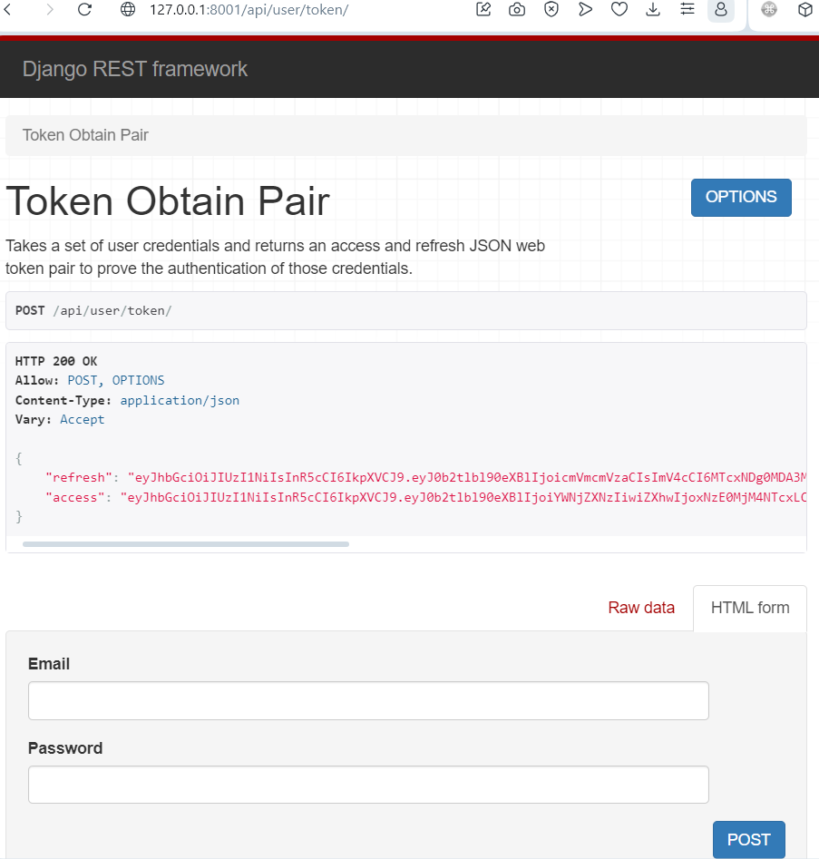
5. Inserting the token into the site header
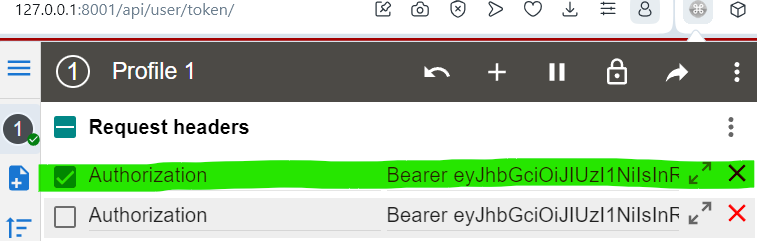
6. All endpoint Airport service
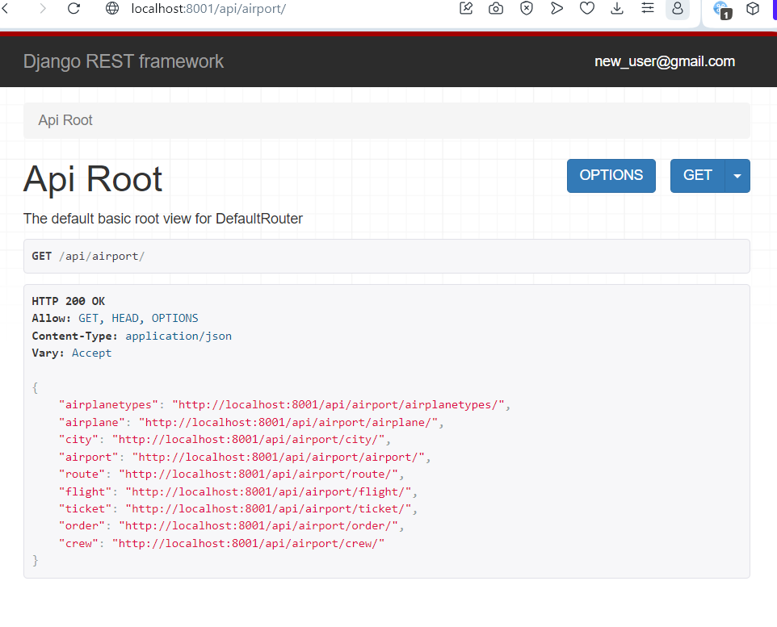
7. Airplanes page
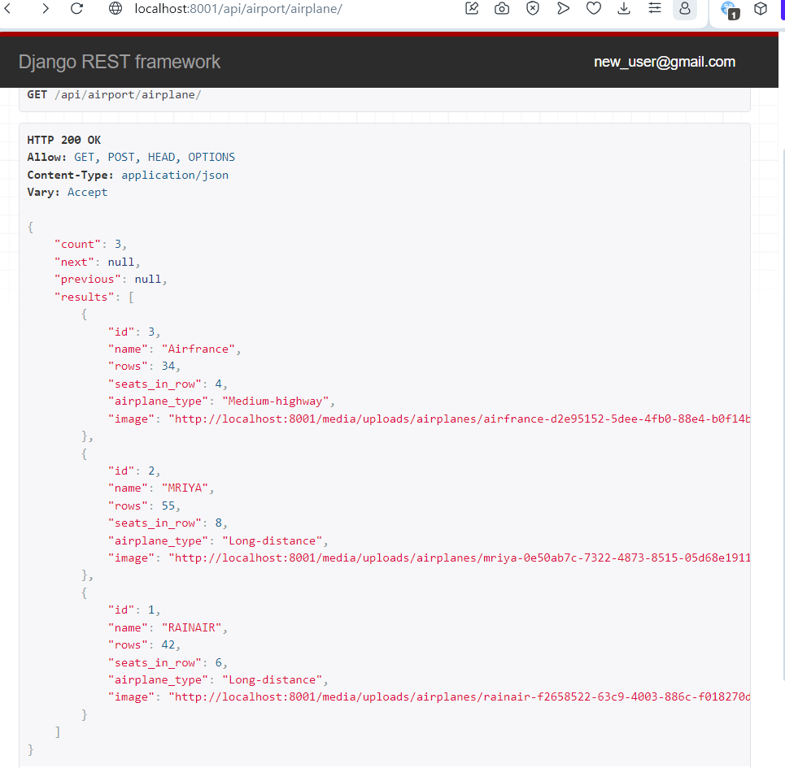
8. Airplane image

9. Сreating a ticket
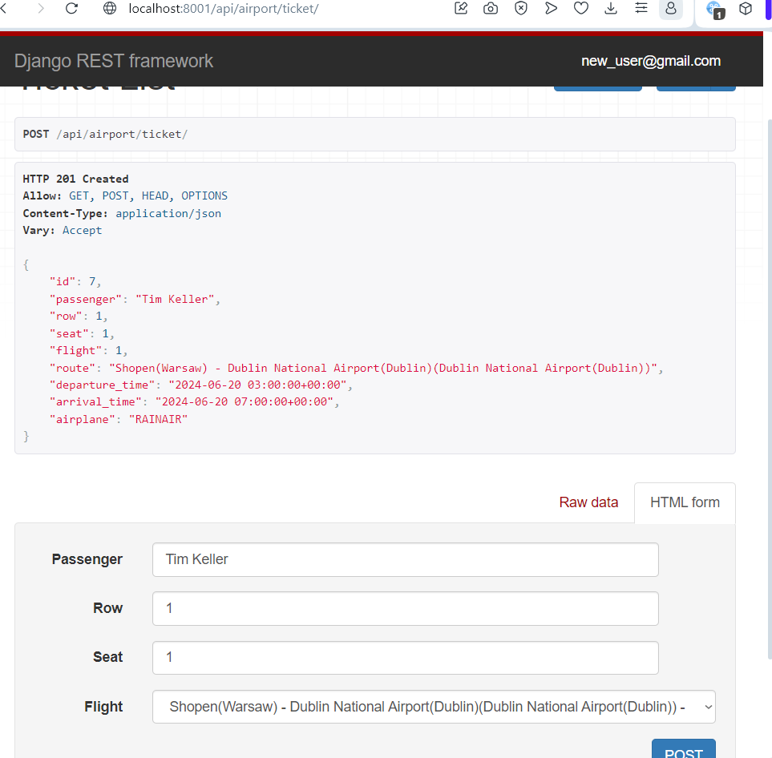
10. Order page
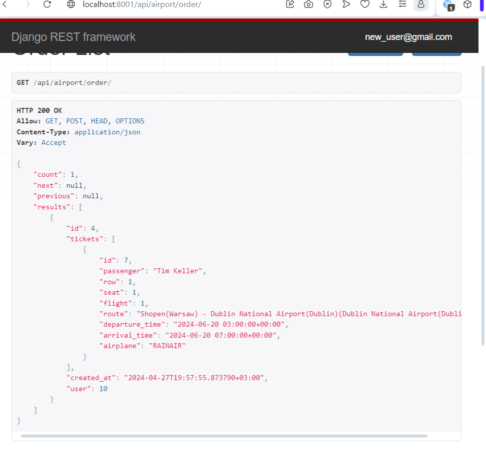
11. Page view Redoc
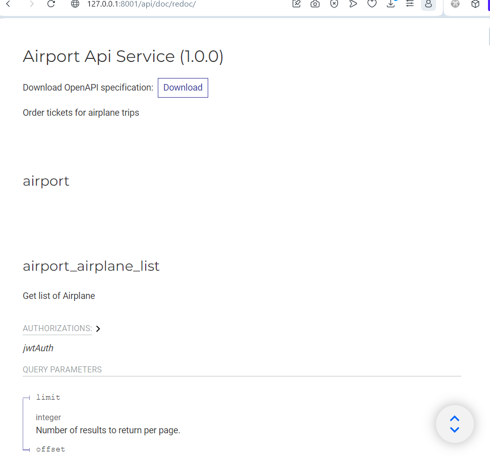
12. Page view Swagger
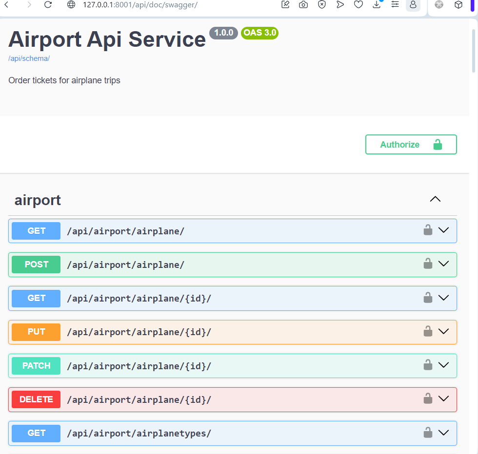